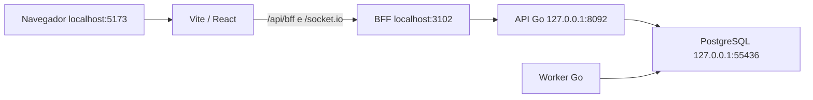

# How-to: executar frontend, BFF e backend localmente

Este guia sobe uma instância **persistente de desenvolvimento** da migração. O frontend React usa o BFF Node.js, que chama o backend Go; PostgreSQL armazena os dados. Não é uma liberação de canário: as limitações funcionais e os bloqueios da GO-036 continuam registrados no [runbook](canario/RUNBOOK.md).

Para usar apenas Docker Compose e Bash no host, vá para [Aplicação inteira com Docker Compose](#alternativa-aplicação-inteira-com-docker-compose). As seções iniciais usam Go e Node instalados no host para desenvolvimento com Vite.

## Pré-requisitos

- Linux, Bash, Git, Go 1.22 e Node.js **22**, com npm.
- Docker Engine e plugin Docker Compose, com permissão de acesso ao daemon.
- Acesso à rede na primeira preparação para a imagem PostgreSQL e dependências npm/Go.
- Execute os comandos abaixo na raiz do repositório.

```bash
go version
node --version
npm --version
docker --context default compose version
```

O contexto padrão destes scripts é `default`, apropriado ao Docker Engine local. Para Docker Desktop, configure o contexto que estiver funcionando em `migracao/local/config.json` antes da preparação. `docker context ls` lista as opções.

## 1. Configurar portas e preparar a instância

Os valores padrão evitam as portas 3100/8090 da prévia anterior e 3101/8091 dos testes E2E.

| Componente | Endereço padrão | Execução |
| --- | --- | --- |
| Frontend React com recarga automática | http://localhost:5173 | Vite |
| BFF e frontend compilado | http://localhost:3102 | Node.js, gerenciado pela CLI |
| API interna Go | http://127.0.0.1:8092 | Binário Go, gerenciado pela CLI |
| PostgreSQL 16 | 127.0.0.1:55436 | Docker Compose, volume persistente |
| Worker Go | Sem porta HTTP | Gerenciado pela mesma CLI |

Opcionalmente, personalize **antes do primeiro setup**:

```bash
cp migracao/local/config.example.json migracao/local/config.json
# Edite portas, dockerContext, tenant e adminEmail.
```

Os quatro números de porta devem ser distintos. O tenant padrão é `local` e o administrador é `admin@local.test`. Não coloque senhas nesse JSON.

```bash
migracao/local/local.sh setup
```

Esse comando cria credenciais aleatórias em arquivos privados, inicia o PostgreSQL exclusivo, compila a distribuição, instala a instância pela CLI e prepara as dependências do Vite. A primeira execução pode demorar alguns minutos.

O setup **não usa `e2e-seed`** nem recria schemas existentes. Reexecutá-lo confere a instância e preserva os dados. Com os serviços de aplicação parados, também pode retomar uma instalação interrompida usando o mecanismo `setup.pending.json` da CLI. Se houver falha, preserve `.state` e o volume antes de investigar.

## 2. Subir os três componentes

No primeiro terminal:

```bash
migracao/local/local.sh up
```

O comando executa o supervisor existente da migração para Go, BFF e worker, além do Vite para desenvolver o frontend. Os processos permanecem no terminal. Uma falha de processo encerra o conjunto que o comando iniciou. Uma porta ocupada provoca erro; o script não mata o processo que a está usando.



O Vite encaminha as chamadas para o BFF pela mesma origem do navegador. O BFF não acessa o banco de domínio. O backend interno exige identidade delegada para suas rotas `/v1`; abrir essas rotas diretamente sem identidade não equivale a estar autenticado na interface.

## 3. Entrar e abrir o frontend

Em outro terminal:

```bash
migracao/local/local.sh login
```

1. Abra o link exibido, que aponta para `http://localhost:3102/login#...` com os valores padrão.
2. O BFF valida o ticket e abre o frontend compilado já autenticado.
3. Para trabalhar com recarga automática, abra **http://localhost:5173** no mesmo navegador.

Use `localhost` nos dois endereços: a sessão é compartilhada entre as portas do mesmo host. Alternar para `127.0.0.1` troca o host do cookie e pode resultar em `401 session_required`. Cookies mantêm as proteções do BFF; o fluxo foi projetado para localhost seguro do navegador.

O link vale por 60 segundos e é consumido uma vez. Gere outro se expirar ou após reiniciar o BFF, que usa sessões em memória. Não compartilhe o link nem o publique em logs/issues. Trata-se do login administrativo emitido pela CLI; o login final de usuários por senha/plugins ainda não tem paridade completa.

A senha inicial fica em `migracao/local/.state/admin-password`, caso precise administrar a instância. Ela é usada no bootstrap; o acesso descrito acima usa o ticket da CLI.

Para conferir o fluxo disponível na interface: clique em **Abrir editor (conectado ao BFF)**, crie uma tabela, crie sua view, publique e abra **Ver views → Visualizar**. Esse recorte funciona para List; o piloto guitars completo ainda tem lacunas.

## 4. Rodar frontend e serviços em terminais separados

Pare `up` com Ctrl+C antes de usar este modo.

Terminal A — backend, BFF e worker, com seus locks de instância/banco:

```bash
migracao/local/local.sh backend-bff
```

Terminal B — frontend React com Vite:

```bash
migracao/local/local.sh frontend
```

Terminal C — gerar acesso e consultar o estado:

```bash
migracao/local/local.sh login
migracao/local/local.sh status
```

Backend/BFF são mantidos juntos pelo supervisor da CLI: isso conserva os locks e o encerramento coordenado implementados na distribuição. Não inicie outro `go run ./cmd/server` ou `node server.js` contra essa mesma instância em paralelo. Os logs dos dois serviços aparecem no terminal A; os do Vite, no terminal B.

## 5. Alterar código e recompilar

- **Frontend:** alterações em `migracao/packages/frontend/src` são recarregadas pelo Vite. O frontend compilado na porta do BFF só muda após novo build.
- **Backend/BFF:** pare a aplicação, compile outra release local e reinicie:

```bash
# Ctrl+C no terminal de up/backend-bff; preserve o PostgreSQL em execução.
migracao/local/local.sh build
migracao/local/local.sh up
```

O build usa `migracao/distribution/build.sh`, instala os lockfiles em árvore temporária e publica uma nova pasta de release somente após sucesso. A release anterior e os dados são preservados. O BFF roda o JavaScript compilado, evitando depender da execução direta de TypeScript por Node.

Se mudar dependências do frontend, pare os processos e execute `setup` novamente para atualizar seu `node_modules`. Mudanças de schema exigem a rotina de migration/backup da [distribuição](../../migracao/distribution/README.md); `build` não aplica migrations implicitamente.

## 6. Verificar, parar e retomar

```bash
migracao/local/local.sh status
curl --fail http://127.0.0.1:8092/healthz
curl --fail http://127.0.0.1:3102/readyz
```

Ctrl+C no terminal de `up` encerra os processos da aplicação e o Vite. No modo separado, pare ambos os terminais. O banco continua em execução e os dados permanecem no volume.

```bash
# Depois de parar a aplicação:
migracao/local/local.sh db-stop

# Para retomar, inclusive após reiniciar o computador:
migracao/local/local.sh db-up
migracao/local/local.sh up
# Em outro terminal, gere novo login.
```

Não apague `.state`, o volume ou use `docker compose down -v` para uma simples reinicialização. Não há comando de reset automático nos scripts.

## Arquivos, persistência e logs

| Caminho | Conteúdo |
| --- | --- |
| `migracao/local/config.example.json` | Configuração inicial sem segredos |
| `migracao/local/config.json` | Personalizações locais, ignoradas pelo Git |
| `migracao/local/compose.yaml` | Somente PostgreSQL local e volume persistente |
| `migracao/local/local.sh` / `local.mjs` | Preparação, inicialização e operação local |
| `migracao/local/.state/instance` | Configuração privada, arquivos e plugins da instância |
| `migracao/local/.state/postgres.env` | Credencial do banco local |
| `migracao/local/.state/releases` | Builds locais; `release.txt` seleciona a próxima inicialização |
| Volume Compose `saltcorn-migracao-local_postgres-data` | Dados PostgreSQL; independente dos containers anteriores |

`.state` é ignorado pelo Git e contém segredos. Preserve-o junto com um backup consistente do banco. Logs de execução aparecem no terminal; para guardar um diagnóstico local, redirecione `up` para um arquivo privado. O comando `login` imprime um segredo temporário e deve ser executado separadamente desses logs.

## Solução de problemas

| Sintoma | Como resolver |
| --- | --- |
| Docker indisponível | Inicie o daemon, confira `docker context ls` e acesso ao contexto configurado. Não é necessário parar containers da prévia anterior. |
| Porta ocupada | Confira quem a usa. Antes do primeiro setup, escolha outra porta no config.json; o script não encerra processos alheios. |
| Configuração diverge da instância | Restaure o config usado no setup. Não mudar portas/tenant com a instância existente; mudança planejada requer migração da configuração/dados. |
| `instância em uso` / `banco em uso` | Pare a execução atual da CLI antes de administrar/recompilar. Não remova arquivos de lock para contornar processos vivos. |
| Falha de conexão PostgreSQL | Execute `db-up`; confirme a porta/contexto e preserve `.state/postgres.env`. Credenciais regeneradas não alteram a senha de um volume já inicializado. |
| Estado local incompleto | Restaure os arquivos privados do backup; o setup recusa regenerar credenciais de uma configuração existente. |
| `401 session_required` | Gere novo `login`, use localhost em ambos os endereços e abra o link dentro de 60 segundos. |
| `502 domain_unavailable` | Confira o terminal Go e `status`; confirme que backend-bff está ativo e que o proxy usa a porta configurada. |
| Alteração no BFF/Go não aparece | Pare, execute `build` e reinicie. Vite recarrega apenas o frontend. |
| Logs `skipped_not_owner` do worker | A instalação local só concede as capacidades suportadas pelo bootstrap. Jobs sem ownership ficam desativados; isso não é falha do Vite/BFF nem autoriza mudar ownership manualmente. |
| Layout/feature não suportado | Consulte a matriz de paridade; iniciar localmente não implementa as capacidades ainda ausentes. |

## Validação reproduzível do how-to

O workflow `migracao-local-ci.yml` executa setup, login no Chromium, criação/publicação de view, escrita/leitura via React/BFF/Go, encerramento, novo setup e reinicialização do PostgreSQL, seguida de nova leitura. Os logs são publicados sem copiar `.state` ou tickets de login.

Para executar o mesmo smoke test com a aplicação ativa, instale as dependências de teste separadas e o Chromium:

```bash
npm ci --prefix migracao/e2e
(cd migracao/e2e && npx playwright install chromium)
node migracao/local/smoke.mjs create
# Após parar/reiniciar aplicação e banco:
node migracao/local/smoke.mjs recheck
```

O teste cria uma tabela de demonstração `local_howto_*` na instância local; o nome fica em `.state/smoke-table.txt`. `recheck` apenas confere a persistência. Essas dependências de navegador são opcionais para desenvolver normalmente.

## Alternativa: aplicação inteira com Docker Compose

Siga o **[passo a passo detalhado de Docker Compose](DOCKER-COMPOSE.md)**. Ele explica os pré-requisitos, a escolha do contexto/porta, a primeira inicialização, o login, a verificação pela interface, logs, recompilação, uso direto do Compose, persistência e diagnóstico, com o resultado esperado em cada etapa.

Na raiz do checkout, com Docker Compose e Bash disponíveis:

```bash
migracao/local/docker.sh up
migracao/local/docker.sh login
```

Abra o link gerado (porta padrão 5180). O Compose usado é `migracao/local/compose.app.yaml`; o script prepara `.docker-state/compose.env`. `config.json` e `compose.yaml` pertencem ao modo `local.sh`, descrito nas seções anteriores.

O modo Docker serve React compilado, com BFF/Go/worker sob o supervisor e PostgreSQL em volumes persistentes. Ele usa uma instância independente do modo `local.sh`. Para parar preservando os dados, execute `migracao/local/docker.sh stop` ou `down`; para retomar, execute `up` e gere novo `login`.
