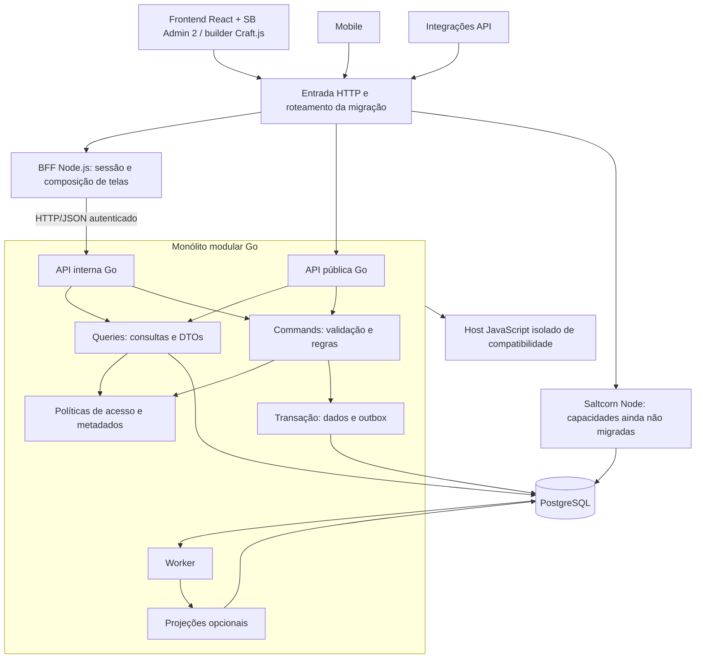

# Migração do Saltcorn para Go

Data: 15/09/2026. Base analisada: commit `1f840815577`, pacotes `1.7.0-alpha.1`.
Status: proposta de arquitetura e backlog; nenhuma migração implementada.

## Recomendação

Migrar incrementalmente para um **monólito modular em Go**, com **CQRS lógico**, **BFF web em Node.js** e **frontend React + SB Admin 2**. PostgreSQL será o primeiro banco suportado pelo novo backend. SQLite, mobile e extensões continuam no escopo de conclusão, mas entram em etapas posteriores.

CQRS separa os caminhos de escrita e leitura; BFF (Backend for Frontend) adapta os serviços às necessidades de uma interface. CQRS fica no backend Go; o BFF Node.js executa em processo separado e consome APIs HTTP/JSON versionadas do backend.

A conversão não é tradução automática de TypeScript: Saltcorn executa aplicações definidas por metadados e extensões. O maior risco é alterar essa semântica. O objetivo é migrar as regras de negócio e a persistência para Go, mantendo Node.js como tecnologia permanente do BFF. O host temporário de plugins JavaScript é um componente separado do BFF e tem seu próprio plano de retirada.

As tarefas executáveis estão em [TASKS.md](TASKS.md), com rotinas individuais de validação e retomada. O [protocolo de execução](EXECUCAO.md) define estados, checkpoints, evidências e controle de concorrência; [tasks.csv](tasks.csv) mantém os campos de acompanhamento. Premissas a validar na fase 0: aplicações prioritárias, plugins instalados, volume de dados, SLOs, equipe, exigência de SQLite/mobile e compatibilidade das extensões de domínio. Não há inventário de produção neste checkout.

## 1. Diagnóstico do repositório

| Área e evidência local | Situação observada | Consequência para a migração |
| --- | --- | --- |
| [Servidor](../../packages/server/app.js), [rotas](../../packages/server/routes/index.ts) | Express, Passport, CSRF, APIs e páginas no mesmo servidor | Separar transporte, autenticação, composição de tela e domínio |
| [Modelos](../../packages/saltcorn-data/models/table.ts), [campos](../../packages/saltcorn-data/models/field.ts) | Dados e tabelas dinâmicos, ownership, roles e RLS | Motor de metadados e autorização são parte central do backend |
| [Banco](../../packages/saltcorn-data/db/index.ts), [contexto multitenant](../../packages/db-common/multi-tenant.ts) | Adapters PostgreSQL/SQLite; tenant e transação propagados por AsyncLocalStorage | Contexto explícito por requisição/job em Go, sem estado global mutável |
| [Builder](../../packages/saltcorn-builder/package.json) | React, Craft.js e webpack | Reaproveitar editor; migrar seus contratos e acesso a dados |
| [Views](../../packages/saltcorn-data/models/view.ts), [layouts](../../packages/saltcorn-data/models/layout.ts), [markup](../../packages/saltcorn-markup/package.json), [tema](../../packages/saltcorn-sbadmin2/package.json) | Renderização e interface distribuídas entre pacotes | Migrar editor e runtime das aplicações como frentes distintas |
| [Expressões](../../packages/saltcorn-data/models/expression.ts), [instalador de plugins](../../packages/plugins-loader/plugin_installer.ts) | Execução JavaScript e ecossistema de plugins | Uma API HTTP não substitui automaticamente objetos, callbacks e acesso ao banco |
| [Triggers](../../packages/saltcorn-data/models/trigger.ts), [workflow](../../packages/saltcorn-data/models/workflow.ts), [scheduler](../../packages/saltcorn-data/models/scheduler.ts) | Automações e execução em background | Preservar ordem, atomicidade, repetição e efeitos externos |
| [Mobile](../../packages/saltcorn-mobile-app/package.json), [SQLite mobile](../../packages/sqlite-mobile/package.json), [sync](../../packages/server/routes/sync.ts) | Runtime local e sincronização | Compatibilidade offline precisa de trilha própria |
| [Testes de dados](../../packages/saltcorn-data/tests), [testes HTTP](../../packages/server/tests), [Playwright](../../deploy/playwright/package.json) | Há suítes que podem fornecer casos de caracterização | Usar comportamento atual como referência, revisando defeitos conhecidos |

Análise estática por amostragem dos componentes acima. Não equivale a auditoria integral de rotas, plugins, segurança ou desempenho. Nenhum ganho de performance foi medido.

## 2. Arquitetura proposta

Banco compartilhado somente durante a transição, com proprietário único de escrita por capacidade/tenant e coordenação explícita de alterações de schema. O diagrama não autoriza Node e Go a modificar livremente o mesmo agregado. O host JS não recebe credenciais irrestritas do banco. O BFF permanente não acessa o banco de domínio; armazenamento de sessão, quando necessário, tem acesso e ciclo de vida próprios.

### Backend

Módulos: identidade/tenancy; metadados/schema; registros/consultas; views/pages/layouts; arquivos; automações; extensões; configuração/packs; sincronização. Interfaces de aplicação independentes de HTTP e SQL. CLI e worker reutilizam os mesmos serviços.

Estrutura sugerida, ainda não criada: `go/cmd/{server,worker,cli}`, `go/internal/{identity,metadata,records,views,automation,extensions,files,sync}`, `go/internal/platform/{database,http,telemetry}` e `contracts/`; `packages/bff/` para Node.js/TypeScript e `packages/frontend/` para React + SB Admin 2. Os pacotes atuais de builder e tema serão reaproveitados por adapters. Cada domínio pode ter `commands`, `queries` e adapters sem um framework genérico obrigatório.

Começar com `net/http`, contratos HTTP/JSON e OpenAPI; selecionar versão Go suportada e drivers na implementação. Usar SQL explícito para metadados estáveis e compilador de consultas para tabelas dinâmicas. ORM ou geração estática de código não cobrem sozinhos schemas definidos pelos usuários. Identificadores SQL devem ser resolvidos por metadados confiáveis e escapados pelo adapter; valores sempre parametrizados. Preservar decimal, datas, timezone, NULL, JSON, referências e chaves compostas conforme a matriz de compatibilidade.

### CQRS

| Opção | Avaliação | Decisão proposta |
| --- | --- | --- |
| CRUD único | Menor custo inicial; tende a manter leitura, efeitos e renderização acoplados | Útil para configurações simples, dentro das interfaces de aplicação |
| CQRS lógico no mesmo banco | Separa validação de escrita e composição de leitura sem sincronização obrigatória | Adotar como padrão de organização |
| CQRS com projeções assíncronas | Ajuda consultas agregadas, mas introduz atraso e reconstrução | Adotar apenas onde benchmark justificar |
| Event sourcing | Exige eventos como fonte da verdade, replay e evolução histórica | Adiar; não necessário para a migração |

Exemplo: `CreateRecord` valida tenant, usuário, schema, tipos, ownership e triggers transacionais; grava registro e outbox na mesma transação; retorna ID e versão. `ListRecords` aplica as mesmas políticas de visibilidade e gera DTO paginado, sem executar ações de negócio. Eventos carregam ID, tenant, versão do schema/evento, agregado, correlação e dados mínimos.

Escritas repetidas: chave de idempotência escopada por tenant/ator/operação e hash do payload; alterações concorrentes: versão esperada e conflito explícito. Triggers que participam da transação permanecem síncronos; e-mails, webhooks e trabalhos posteriores ao commit usam outbox durável. Entrega pelo menos uma vez, deduplicação no consumidor, retries limitados e fila de falhas inspecionável. Não prometer exactly-once em serviços externos.

Leitura após escrita usa o banco primário inicialmente. Projeções futuras informam watermark/versão e atraso, com fallback para leitura autoritativa quando necessário. Revogação de acesso é verificada na fonte atual, inclusive sobre resultados projetados; caches incluem tenant, identidade/política e versão. Event log existente não deve ser presumido como event store ou outbox.

CQRS admite modelos separados com banco compartilhado; bancos distintos acrescentam sincronização e consistência eventual. Essa distinção fundamenta a escolha acima. [Referência CQRS](https://learn.microsoft.com/en-us/azure/architecture/patterns/cqrs).

### Frontend

Adotar React para componentes e interação e SB Admin 2 para o tema administrativo (sidebar, topbar, navegação, estilos e assets), reaproveitando `packages/saltcorn-sbadmin2`. Manter Craft.js no builder e introduzir TypeScript gradualmente nas áreas alteradas. O pacote de tema existente precisa ser desacoplado da renderização de servidor: mapear templates para componentes React e encapsular widgets imperativos para evitar que React e scripts legados manipulem o mesmo DOM. Criar cliente tipado para os contratos do BFF, remover dependência do frontend de modelos de servidor e definir documento versionado de layout. Separar: editor administrativo; renderizador das aplicações publicadas; mobile/offline.

Preservar URLs, formulários, navegação, traduções, acessibilidade, temas e widgets utilizados. Páginas ainda dependentes de renderização Node permanecem no legado até o renderizador novo passar nos testes. Evitar reescrever toda a UI e backend no mesmo marco. Go/WASM só deve entrar se um experimento demonstrar vantagem concreta para uma capacidade compartilhada.

### BFF

Adotar um serviço BFF Node.js/TypeScript para compor bootstrap do editor, permissões de interface, metadados e dados de telas React + SB Admin 2. Ele cuida de sessão/cookies, CSRF, paginação e erros voltados à UI; domínio revalida autorização em todo comando/query. Não acessa tabelas diretamente nem concentra regras de negócio. Integrações usam API pública versionada; mobile pode ganhar BFF próprio quando contratos e uso justificarem.

BFF e backend têm processos, builds, health checks e releases próprios. O BFF usa cliente tipado HTTP/JSON para a API interna Go, com autenticação entre serviços e identidade delegada verificável (ator e tenant); o backend valida credenciais e autorização. Definir timeouts, cancelamento, correlação de traces e limites de concorrência. Retries de comandos exigem a mesma chave de idempotência e política explícita; uma composição de chamadas no BFF não constitui transação de domínio. A indisponibilidade do Go deve produzir erro controlado na UI. O custo adicional de rede e operação entra nos benchmarks e na distribuição self-hosted. [Referência BFF](https://learn.microsoft.com/en-us/azure/architecture/patterns/backends-for-frontends).

## 3. Compatibilidade e segurança da transição

1. Inventariar recursos por aplicação e classificar: nativo Go, compatibilidade Node temporária ou bloqueador de migração. Não aceitar perda silenciosa.
2. Criar fachadas por capacidade e tenant. Começar com consultas de metadados e depois um fluxo vertical de CRUD, sempre com autorização completa. O padrão de substituição gradual orienta o roteamento. [Strangler Fig](https://learn.microsoft.com/en-us/azure/architecture/patterns/strangler-fig).
3. Fazer shadow apenas de consultas comprovadamente sem efeitos, usando tráfego sanitizado; comparar dados, ordenação, erros e permissões. Escritas são comparadas em bases isoladas restauradas da mesma fixture.
4. Transferir escrita por unidade consistente: CRUD, triggers, jobs, plugins e schema relacionados. Bloquear caminhos antigos de mutação; operações que exigirem transação entre runtimes ficam integralmente no proprietário atual até serem portadas.
5. Evoluir schema por expansão/contração, com um executor de migrações, locks, checkpoints por tenant e backups. Só contrair depois de encerrar a janela de rollback.
6. Fazer canário por tenant/capacidade. Rollback de roteamento só é permitido se Node compreender os dados e metadados escritos por Go. Caso contrário, pausar escritas e executar reconciliação/restauração ensaiada; retorno de tráfego sozinho não reverte dados.

Tenant é derivado de host/mapeamento confiável e identidade validada, nunca de header arbitrário. Contexto acompanha requisições, transações, jobs e plugins. Provar ausência de vazamento em pool de conexões, caches e execução concorrente. Migrar passwords, sessões, tokens, MFA e estratégias de autenticação com fixtures; preferir reautenticação planejada a compartilhar sessões sem prova de compatibilidade.

Plugins JS exigem classificação: tipos, fieldviews, ações, views, autenticação, hooks e dependências Node. Host temporário por RPC com capacidades explícitas, limites de memória/CPU/tempo e isolamento de processo/OS; simples uso de VM não constitui toda a fronteira de segurança. Plugins que dependem de transações ou objetos internos ficam no caminho legado até adaptação. O domínio é considerado integralmente migrado para Go depois de retirar esse host para o escopo contratado. O BFF Node.js permanece na arquitetura final e não executa plugins de domínio.

## 4. Etapas e marcos

| Fase | Entrega | Gate de saída |
| --- | --- | --- |
| F0 Descoberta | Matriz de paridade, baseline e decisões | Escopo piloto e critérios mensuráveis definidos |
| F1 Fundação | Estrutura Go, contratos React/BFF/Go, identidade e tenancy | Isolamento e políticas equivalentes demonstrados |
| F2 Dados/CQRS | Metadados, queries, commands e outbox | CRUD dinâmico com transação e concorrência validado |
| F3 Experiência web | BFF Node.js, React + SB Admin 2, editor integrado e renderizador piloto | Criar tabela → editar view → publicar → operar registros |
| F4 Plataforma | Automação, plugins, arquivos, packs e realtime | Recursos usados pelo piloto cobertos ou bloqueados explicitamente |
| F5 Paridade estendida | SQLite, mobile, CLI e corpus completo | Matriz do escopo contratado sem lacunas |
| F6 Corte | Canário, recuperação e retirada do legado | Operação estável, legado retirado e BFF Node.js mantido |

F3 pode avançar com mocks após os contratos de F1; F4 pode ser prototipada em paralelo após F0. O corte depende das capacidades reais de cada aplicação, não apenas da ordem das fases.

Piloto proposto: aplicação PostgreSQL com dois tenants, usuários com papéis diferentes, tabela com relação, listagem/filtro, formulário e uma automação. Extensões especiais permanecem bloqueadores explícitos até paridade. Piloto não representa conversão integral.

Planejamento indicativo, sem compromisso de prazo: descoberta 2–4 semanas; fundação e fluxo vertical 6–10; piloto web operacional mais 6–10. Hipótese: 2 profissionais Go, 1 frontend React, 1 profissional Node.js/BFF, 1 QA/automação, apoio parcial de plataforma e alguém com conhecimento Saltcorn. Intervalos são hipóteses de calendário e não medições; paridade completa de plugins/mobile requer reestimativa após F0. Usar tamanhos relativos do backlog para refinamento, sem convertê-los automaticamente em dias.

## 5. Aceite global e riscos

Antes do piloto, registrar limites de p95/p99, throughput, memória, atraso de jobs/projeções e taxa de erro com o mesmo dataset e ambiente do legado. Proposta inicial: nenhum desvio funcional nos casos críticos, nenhum acesso entre tenants e p95 sem regressão superior a 10% no corpus acordado. Ajustar esse limite em F0; não é desempenho comprovado. Definir RPO/RTO de acordo com a operação e ensaiar recuperação dentro deles.

| Risco | Mitigação / evidência necessária |
| --- | --- |
| Divergência de expressões JS, datas e valores nulos | Corpus de fixtures e comparação por expressão; host temporário para incompatíveis |
| Bypass de autorização em query/cache/projeção | Testes negativos por tenant, papel, ownership, RLS e revogação |
| Dois escritores e DDL concorrente | Matriz de ownership, bloqueio do caminho antigo e executor único de migrations |
| Trigger duplicado ou perdido | Classificar atomicidade, testar crash antes/depois do commit e deduplicação |
| Plugins dependentes de internals | Inventário por plugin/versão; porta nativa, adapter ou bloqueio de corte |
| Layout/editor incompatível | Fixtures de documentos, round-trip, snapshots visuais e E2E |
| SQLite/offline incompatível com PG | Testar ambos os adapters e conflitos de sincronização; não presumir equivalência SQL |
| Reescrita interminável | Corte por aplicação/capacidade, medir uso legado e gates explícitos de retirada |

Transações Go precisam usar a mesma unidade transacional para todas as operações relacionadas; não misturar chamadas fora dela no fluxo atômico. [Documentação Go](https://go.dev/doc/database/execute-transactions).

Conclusão da migração: frontend React + SB Admin 2 integrado ao BFF Node.js; capacidades de domínio acordadas e persistência no backend Go; dados e configurações reconciliados; recuperação testada e operação documentada para os dois serviços. O BFF Node.js faz parte da solução final. Dependência do backend legado ou do host temporário de plugins de domínio significa migração ainda em andamento.
